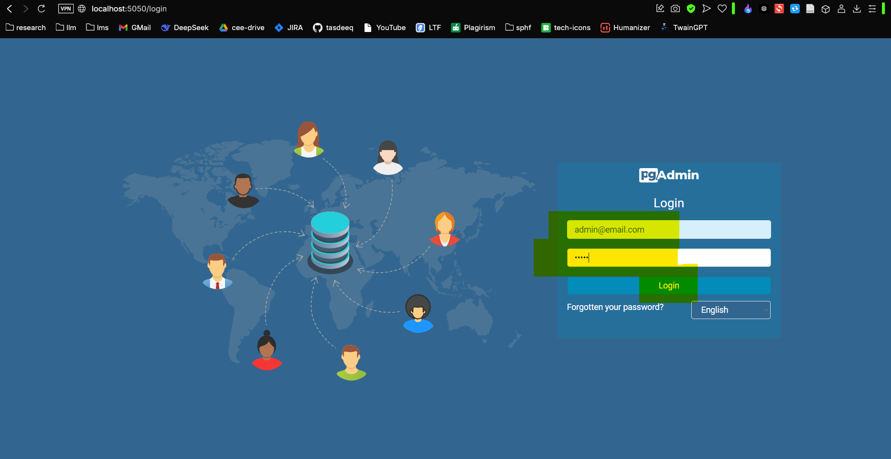
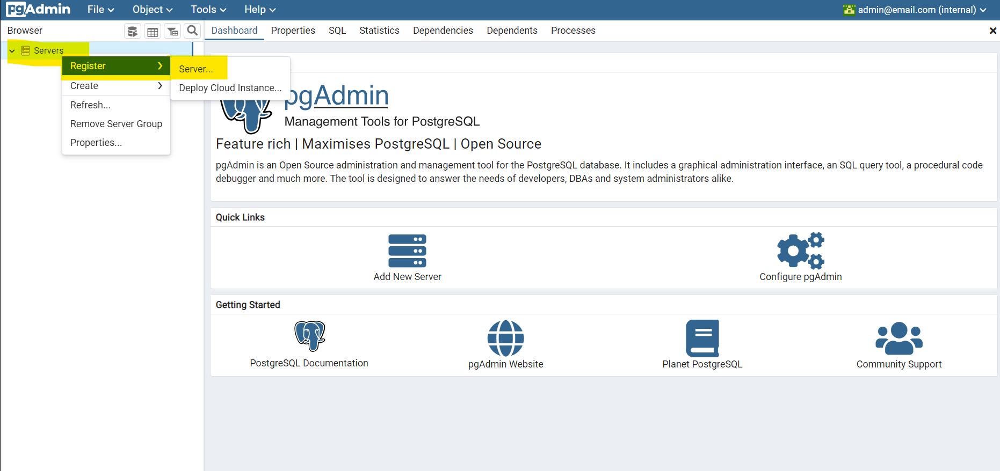
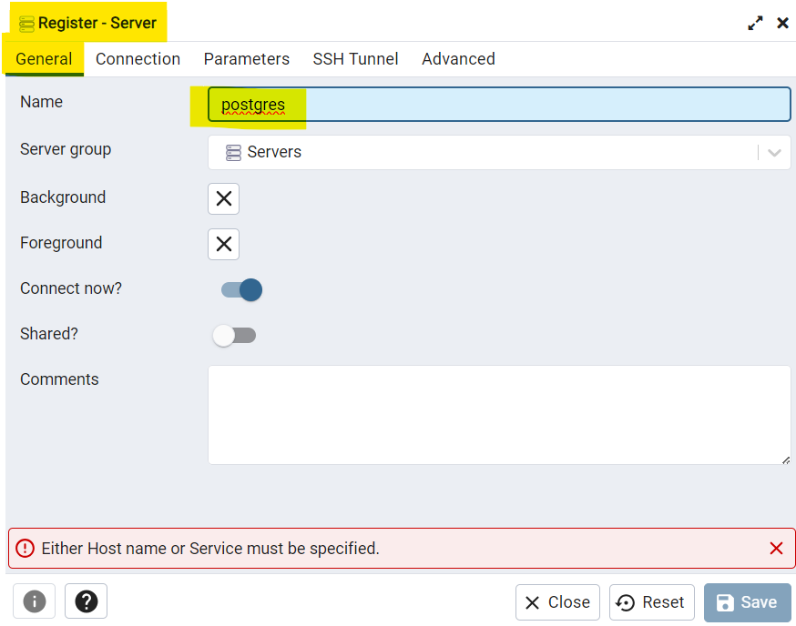
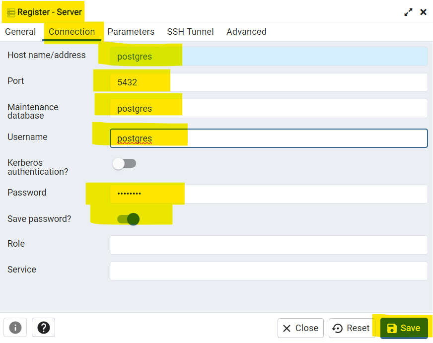
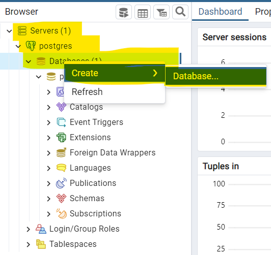
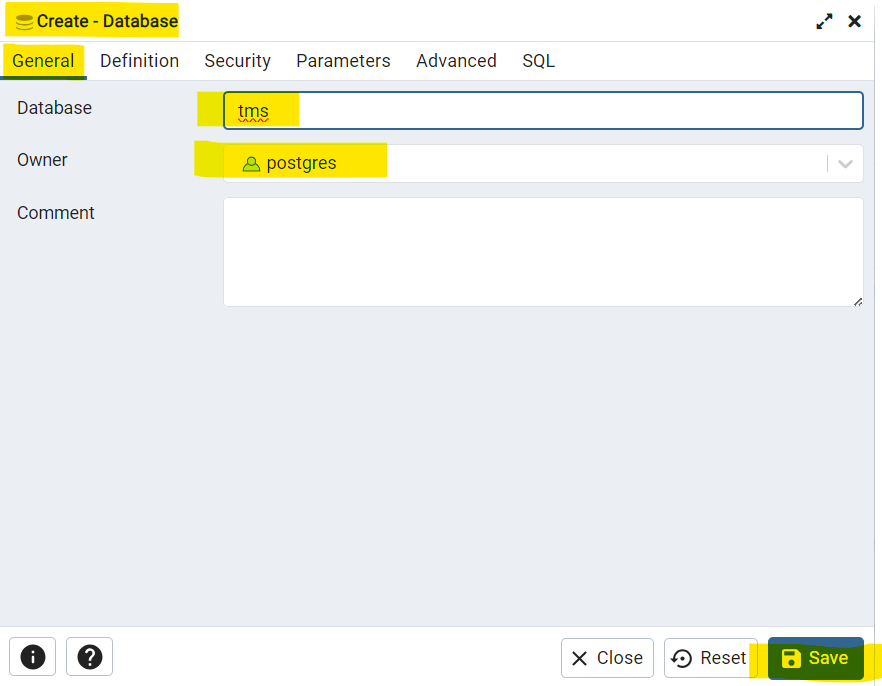

# Translation Management System

* ## Steps to Get Started

1. #### Clone the repository:
   > * open terminal and type
   > * git clone https://github.com/ChanderParkash179/translation-management-system.git
   > * Now enter `cd translation-management-system`

2. #### Open the project in your preferred coding editor like VSCode, IntelliJ IDEA, etc.

3. #### Open a terminal and install dependencies:
   > `mvn clean install`

4. #### Start Docker containers for PostgreSQL and pgAdmin:
   > `docker-compose up` OR `docker-compose up -d` AND `wait for a while`

5. #### Access pgAdmin in your browser do below steps:
   > * Type URL `http://localhost:5050/` hit enter and wait.
   > * Type email:  `admin@email.com` in email section.
   > * Type password: `admin` in password section and hit enter.

   > 

6. #### pgAdmin setup
   > * right click on `Server` and then click on `Register` and then add `Server` like shown below:
       

   > * Now Click firstly on `General` tab and type `postgres` in name textbox like shown below:
       

   > * Now Go to `Connection` tab like shown below:
   > * Enter Host name/address: `postgres`, port: `5432`, Maintained database: `postgres`, username: `postgres`, password: `postgres` and enable the `Save password` option:
       

   > * Now right click on `server` -> `postgres` -> `databases` -> `create` -> `database`
       

   > * Now type name of database by validating application.properties file database: `tms`
       

7. #### Project Execution
   > * open terminal (cmd/powershell) on project location
   > * type `mvn clean install` for Dependencies Update
   > * type `mvn spring-boot::run` for project execution

8. #### running the factory command for db-seed
    > * Navigate to `target` folder by typing `cd target`
    > * type `java -jar translation-management-system-0.0.1-SNAPSHOT.jar --populate-data=100000`
    > * above number is up to your choice